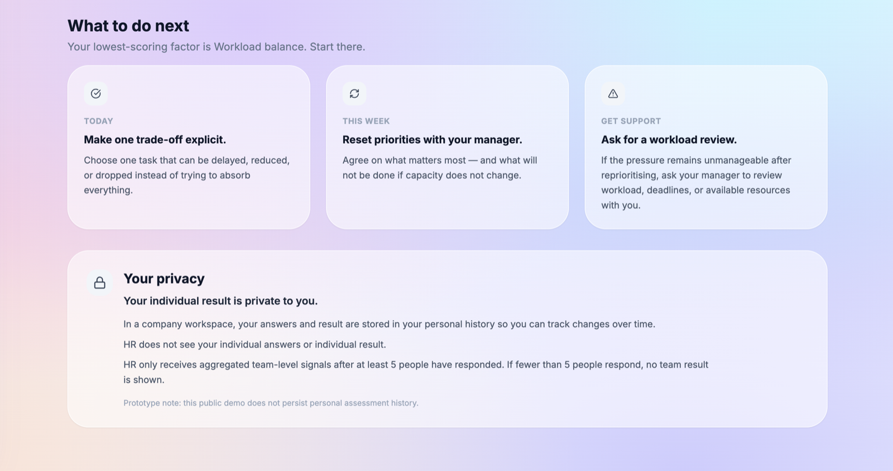
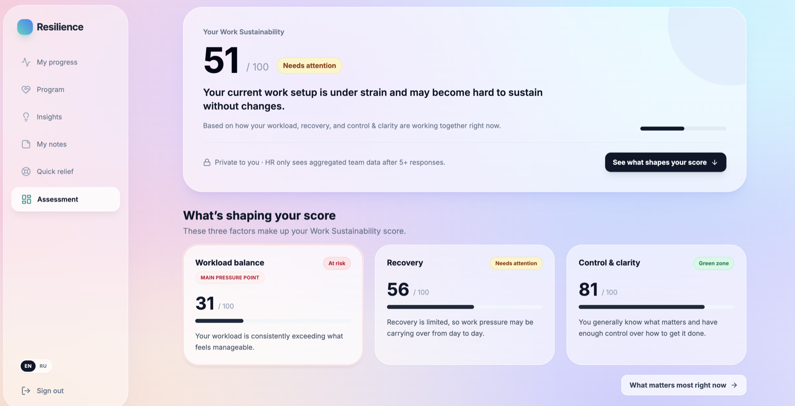
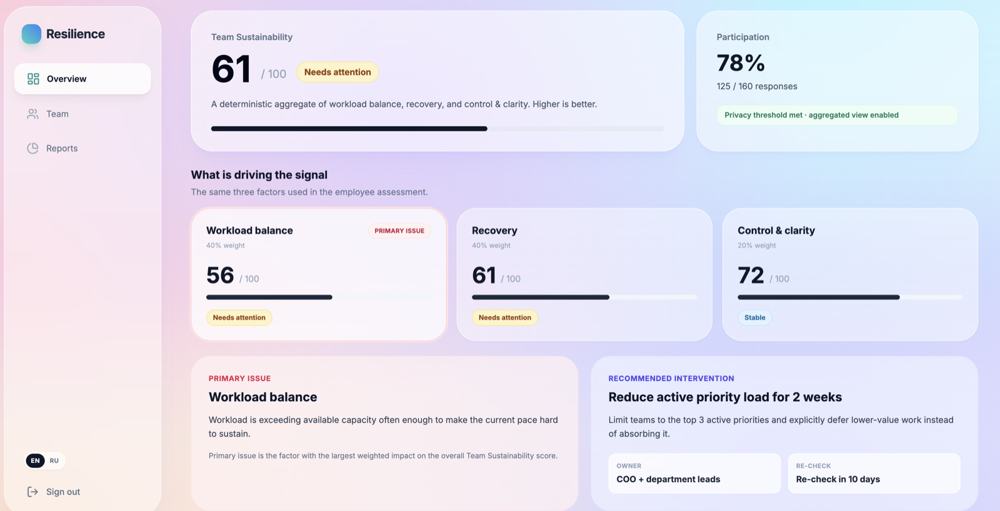
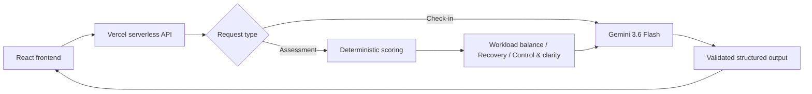

# Resilience.ai

**AI-enabled B2B HRTech prototype for work sustainability and workforce resilience.**

**Live demo:** https://resilience-ai-eta.vercel.app

**Release notes:** [RELEASE_NOTES.md](RELEASE_NOTES.md)

Resilience.ai is a portfolio-grade product prototype that demonstrates how employee work-sustainability signals can be turned into a working employee and HR decision loop without waiting for a full engineering team.

The project is intentionally scoped as a **prototype, not a production SaaS**. It focuses on the product flows, AI architecture, assessment logic, HR analytics and privacy decisions that are most useful for validating the concept and discussing it in product interviews.

> **Portfolio note:** HR/team data shown in the demo is synthetic. The employee assessment is a custom non-clinical Work Sustainability check and is not a medical diagnostic tool.

## Live product flows

### Employee experience
- Mood / stress check-in
- AI-generated personalized recommendation
- 12-question Work Sustainability assessment
- Three factors: **Workload balance, Recovery, Control & clarity**
- Deterministic 0–100 scoring with fixed **40 / 40 / 20** weights
- AI-generated interpretation and personalized next steps
- 12-week resilience program
- Insights, notes and stress first-aid content

### HR experience
- Privacy-safe aggregated **Team Sustainability** view
- Workload balance / Recovery / Control & clarity drivers
- Participation and minimum 5-response privacy threshold
- Deterministic primary issue
- Recommended intervention, owner and 7–14 day re-check
- Before / after outcome
- Department-level synthetic demo scenarios

## Screenshots

### AI check-in



### Structured assessment result



### HR decision loop



## AI design

The prototype deliberately separates **deterministic product logic** from **generative AI**.



### Why this split matters

The LLM is **not used as a calculator**. Assessment scores are computed by fixed rules, including reverse-scoring of positive questions. Gemini receives the already-calculated metrics and is responsible only for qualitative interpretation and personalized recommendations.

This makes the result more reproducible, explainable and easier to defend in a product / AI architecture discussion.

## Secure API architecture

Gemini is called only from the serverless layer.

- No Gemini API key is shipped in the browser bundle.
- `GEMINI_API_KEY` is stored as a server-side environment variable.
- `.env.local` is gitignored.
- AI responses are validated before being returned to the UI.
- Assessment input is validated server-side.

The frontend calls only:

```text
POST /api/check-in
POST /api/assessment
```

## Assessment logic

The 12-item custom assessment measures three Work Sustainability factors on a 0–100 scale:

- **Workload balance** — 4 questions
- **Recovery** — 4 questions
- **Control & clarity** — 4 questions

Responses use a 1–5 scale covering the previous two weeks.

Positive items are normalized as `1→0, 2→25, 3→50, 4→75, 5→100`.

Reverse-coded items first use `effective = 6 - answer` and then the same normalization.

Overall Work Sustainability is calculated deterministically:

`Work Sustainability = 0.4 × Workload balance + 0.4 × Recovery + 0.2 × Control & clarity`

Higher is better.

Status bands:

- **80–100** — Green zone
- **65–79** — Stable
- **45–64** — Needs attention
- **0–44** — At risk

The primary pressure factor is selected by weighted impact on the overall score, not simply by the lowest raw factor score.

Gemini does **not** calculate or change numeric scores. It receives the deterministic result and is used only for qualitative interpretation and allowed next-step actions.

This is a **product heuristic**, not a clinical or diagnostic model.

## HR decision loop

The HR dashboard mirrors the employee model using synthetic aggregated team data:

**Team Sustainability → 3 drivers → primary issue → recommended intervention → owner → re-check → outcome**

The demo uses a minimum **5-response privacy threshold** before aggregated team signals are shown.

Synthetic outcomes demonstrate the decision loop only and are not evidence of causal impact.

Survey-derived sustainability signals are not translated directly into FTE or staffing requirements.

## Product / privacy choices

A few choices are intentional and part of the product case:

- HR sees **aggregated team sustainability signals**, not individual employee assessment results.
- Aggregated HR signals require at least **5 responses**.
- Demo/history data is explicitly marked as synthetic.
- The employee assessment is described as a Work Sustainability check, not a clinical diagnosis.
- Placeholder actions that would imply non-existent functionality were removed rather than faked.
- Browser history and deep links work for the main employee and HR routes.

## Tech stack

- React 19
- TypeScript
- Vite 6
- Vercel Serverless Functions
- Google Gemini API (`gemini-3.6-flash`)
- Recharts
- Tailwind CSS (CDN, acceptable for prototype scope)

## Main routes

```text
/employee/progress
/employee/program
/employee/assessment
/employee/program/module/:id

/hr/dashboard
/hr/team
/hr/reports
```

## Run locally

### Prerequisites

- Node.js 20+
- npm
- Vercel account
- Gemini API key

### 1. Install dependencies

```bash
npm install
```

### 2. Link the local project to Vercel

```bash
npx vercel link
```

### 3. Configure the secret

Add `GEMINI_API_KEY` to the project's Vercel Environment Variables for Development (and Production when deploying), then pull it locally:

```bash
npx vercel env pull .env.local
```

Never commit `.env.local` or an API key.

### 4. Start the full local app

```bash
npx vercel dev
```

Then open the URL printed by Vercel CLI, usually `http://localhost:3000`.

### Production build check

```bash
npm run build
```

## Prototype limitations

This repository is intentionally not a full enterprise wellbeing platform. In particular:

- authentication is simulated;
- HR and employee history data is synthetic;
- there is no persistent database;
- there are no real HRIS integrations;
- program content is representative rather than complete;
- Tailwind is loaded via CDN;
- the assessment is custom and non-clinical.

These constraints are deliberate: the goal is to validate and demonstrate the product and AI architecture, not to recreate a production HR suite.

## What this project demonstrates

This project is intended as evidence of **hands-on AI product prototyping** by a Product Lead / Senior Product Manager:

- translating a product hypothesis into working employee and HR workflows;
- selecting where AI adds value and where deterministic logic is safer;
- implementing structured AI outputs;
- designing a secure browser → serverless → LLM boundary;
- thinking through privacy and responsible product positioning;
- iterating from an old pet project to a deployable public prototype.

---

**Resilience.ai** — portfolio prototype for work sustainability and workforce resilience.
