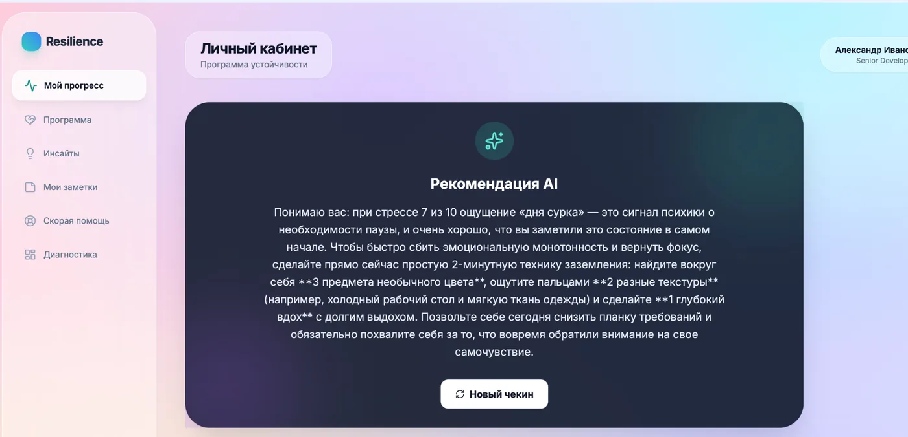
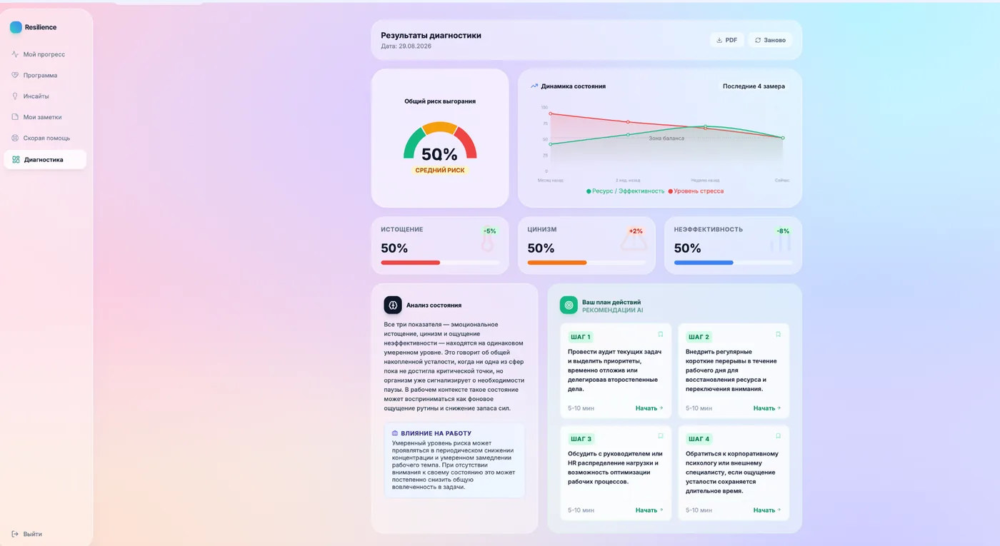
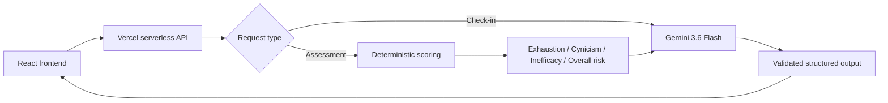

# Resilience.ai

**AI-enabled B2B HRTech prototype for employee burnout prevention and workforce resilience.**

**Live demo:** https://resilience-ai-eta.vercel.app

Resilience.ai is a portfolio-grade product prototype that demonstrates how an employee wellbeing hypothesis can be turned into a working AI-enabled product without waiting for a full engineering team.

The project is intentionally scoped as a **prototype, not a production SaaS**. It focuses on the product flows, AI architecture, assessment logic, HR analytics and privacy decisions that are most useful for validating the concept and discussing it in product interviews.

> **Portfolio note:** all employee and HR data shown in the demo is synthetic. The self-assessment is a custom non-clinical screening and is not a medical diagnostic tool.

## Live product flows

### Employee experience
- Mood / stress check-in
- AI-generated personalized recommendation
- 12-question resilience / burnout-risk self-assessment
- Deterministic scoring across three dimensions
- AI-generated interpretation and personalized next steps
- 12-week resilience program
- Insights, notes and stress first-aid content

### HR experience
- Aggregated workforce wellbeing dashboard
- Stress, productivity and participation trends
- Department-level analytics
- Program engagement overview
- Privacy-aware team view without individual burnout scores
- Synthetic report examples

## Screenshots

### AI check-in



### Structured assessment result



## AI design

The prototype deliberately separates **deterministic product logic** from **generative AI**.



### Why this split matters

The LLM is **not used as a calculator**. Assessment scores are computed by fixed rules, including reverse-scoring of positive questions. Gemini receives the already-calculated metrics and is responsible only for qualitative interpretation and personalized recommendations.

This makes the result more reproducible, explainable and easier to defend in a product / AI architecture discussion.

## Secure API architecture

Gemini is called only from the serverless layer.

- No Gemini API key is shipped in the browser bundle.
- `GEMINI_API_KEY` is stored as a server-side environment variable.
- `.env.local` is gitignored.
- AI responses are validated before being returned to the UI.
- Assessment input is validated server-side.

The frontend calls only:

```text
POST /api/check-in
POST /api/assessment
```

## Assessment logic

The 12-item custom screening produces four deterministic values on a 0–100 scale:

- Emotional exhaustion
- Cynicism / distancing
- Perceived inefficacy
- Overall burnout-risk score

Positive statements are reverse-scored. Each conceptual dimension has equal weight in the overall result even though the dimensions contain different numbers of questions.

The resulting metrics are then passed to Gemini for:

- a short qualitative summary;
- possible productivity impact;
- 3–4 personalized, low-risk next steps.

## Product / privacy choices

A few choices are intentional and part of the product case:

- HR sees **aggregated wellbeing metrics**, not individual employee burnout scores.
- Demo/history data is explicitly marked as synthetic.
- The employee assessment is described as a wellbeing self-assessment, not a clinical diagnosis.
- Placeholder actions that would imply non-existent functionality were removed rather than faked.
- Browser history and deep links work for the main employee and HR routes.

## Tech stack

- React 19
- TypeScript
- Vite 6
- Vercel Serverless Functions
- Google Gemini API (`gemini-3.6-flash`)
- Recharts
- Tailwind CSS (CDN, acceptable for prototype scope)

## Main routes

```text
/employee/progress
/employee/program
/employee/assessment
/employee/program/module/:id

/hr/dashboard
/hr/team
/hr/reports
```

## Run locally

### Prerequisites

- Node.js 20+
- npm
- Vercel account
- Gemini API key

### 1. Install dependencies

```bash
npm install
```

### 2. Link the local project to Vercel

```bash
npx vercel link
```

### 3. Configure the secret

Add `GEMINI_API_KEY` to the project's Vercel Environment Variables for Development (and Production when deploying), then pull it locally:

```bash
npx vercel env pull .env.local
```

Never commit `.env.local` or an API key.

### 4. Start the full local app

```bash
npx vercel dev
```

Then open the URL printed by Vercel CLI, usually `http://localhost:3000`.

### Production build check

```bash
npm run build
```

## Prototype limitations

This repository is intentionally not a full enterprise wellbeing platform. In particular:

- authentication is simulated;
- HR and employee history data is synthetic;
- there is no persistent database;
- there are no real HRIS integrations;
- program content is representative rather than complete;
- Tailwind is loaded via CDN;
- the assessment is custom and non-clinical.

These constraints are deliberate: the goal is to validate and demonstrate the product and AI architecture, not to recreate a production HR suite.

## What this project demonstrates

This project is intended as evidence of **hands-on AI product prototyping** by a Product Lead / Senior Product Manager:

- translating a product hypothesis into working employee and HR workflows;
- selecting where AI adds value and where deterministic logic is safer;
- implementing structured AI outputs;
- designing a secure browser → serverless → LLM boundary;
- thinking through privacy and responsible product positioning;
- iterating from an old pet project to a deployable public prototype.

---

**Resilience.ai** — portfolio prototype for employee burnout prevention and workforce resilience.
